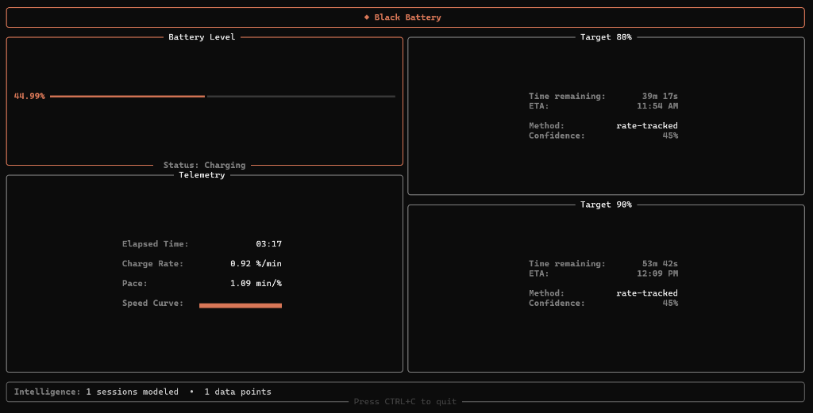

# ⚡ Black Battery

**The ultimate, over-engineered solution to a very specific laptop hardware defect.**



---

## 📖 The Origin Story

I own a **Lenovo IdeaPad Gaming 3**. It's a great laptop, except for one tiny, soul-crushing quirk: **If I let the battery charge to 100%, it throws a temper tantrum.** 

Instead of gradually decreasing like a normal battery, it will suddenly drop from 100% straight to 0%, die instantly, and then actively *refuse to charge* no matter how many times I plug it in. I'll spend days staring at a dead brick until it miraculously decides to start working again. 

I got tired of living in constant fear of my battery hitting 100%, so I built **Black Battery**—an absurdly precise, machine-learning-powered command-line dashboard that tracks my charging speed in real-time and tells me exactly when it will hit 80% and 90% so I can yank the cord out before my laptop self-destructs.

---

## 🚀 Features

* **Invisible Watcher Daemon**: A silent background process (`monitor.pyw`) that uses 0% CPU. When you plug your charger in, the dashboard magically pops up on your screen. When you unplug, it cleanly disappears.
* **Claude-Inspired HUD**: A minimalist, terminal-based dashboard built with `rich`, featuring soft terracotta colors, rounded borders, and a live ASCII sparkline graph of your charging speed.
* **Sub-Percent Interpolation**: Windows only reports battery in 1% jumps. We mathematically hacked it to display live sub-percent values (e.g., `41.78%`) that tick up every second.

---

## 🧠 The Machine Learning Engine

Why use basic math when you can use Machine Learning? 

Most battery predictors just guess your ETA based on a flat line. But Lithium-ion batteries don't charge in a straight line. They charge in two phases:
1. **Constant Current (CC)**: 0% to ~80% (Fast and linear)
2. **Constant Voltage (CV)**: 80% to 100% (Exponentially slows down)

### How Black Battery's ML Works:
1. **Phase-Aware Rate Tracking**: Instead of fitting polynomials to noisy data, it calculates the exact `minutes-per-percent` for every single 1% transition in real-time.
2. **Historical Calibration**: Every time you charge, the `ml_engine.py` saves the session to a local JSON databank. It learns the exact charging curve shape of *your specific laptop and charger combo*. 
3. **Smart Confidence**: The more you charge, the smarter it gets. On Session 1, it relies on real-time physics. By Session 5, it knows your battery better than Lenovo does, calibrating real-time predictions against historical averages to give you to-the-minute accuracy for your 80% and 90% targets.

---

## 🛠️ Usage

Simply run the server to view the dashboard:

```bash
python server.py
```

To enable the invisible background watcher to run automatically when Windows starts:

```bash
python server.py --autostart
```

To remove it from startup:

```bash
python server.py --remove-autostart
```

---

*Built with Python, `psutil`, `rich`, and an overwhelming fear of reaching 100% charge.*
